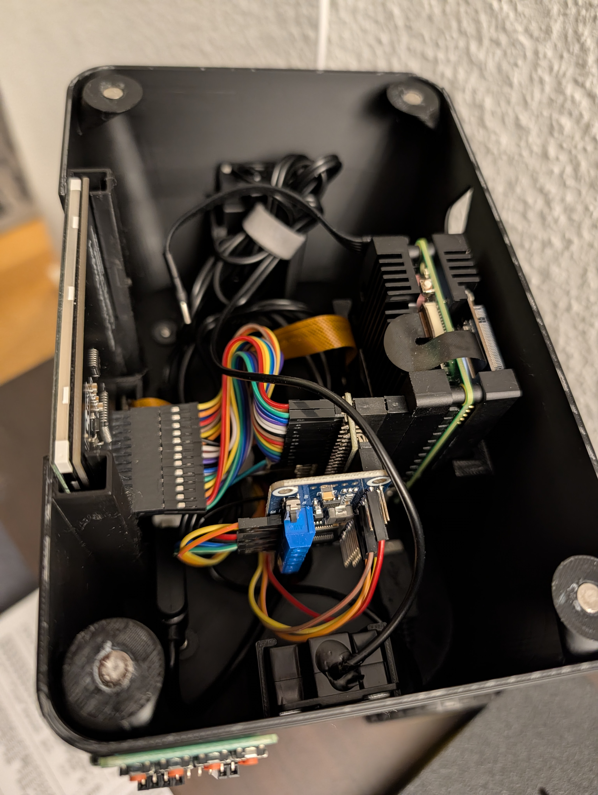
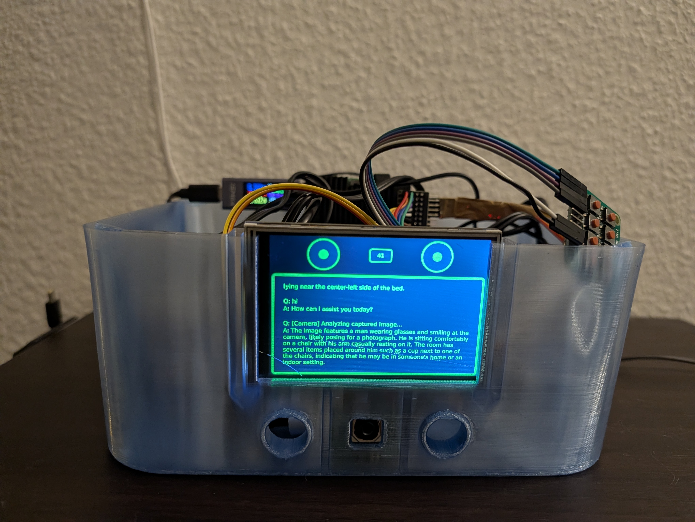
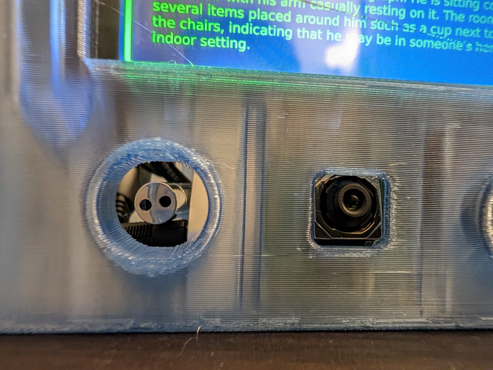
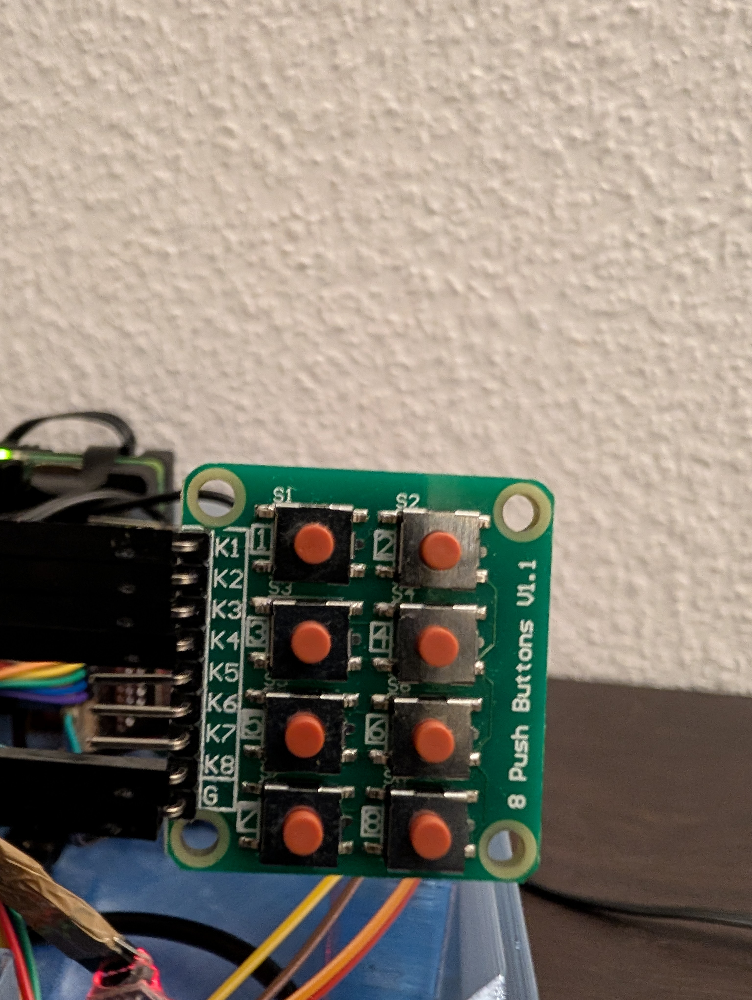

# RPi 5 AI Robot Setup for Raspberry Pi OS

Automated setup to replicate a Yocto-based AI robot system on Raspberry Pi OS (Debian 13).

## Hardware Requirements

- **Board:** Raspberry Pi 5 (4GB RAM minimum)
- **Display:** 3.5" SPI Touch Display (piscreen compatible)
- **Camera:** Raspberry Pi Camera Module 3 (IMX708)
- **Audio:** USB Microphone and Speakers
- **Buttons:** 8x GPIO buttons (K1-K8) on GPIO pins: 5, 6, 13, 19, 26
- **Storage:** 16GB+ SD card or NVMe SSD (32GB+ recommended for models)
- **Cooling:** Official RPi 5 Active Cooler (recommended)

## Features

- **Voice Chat:** Hold K1 button to speak, release to get AI response
- **Camera Vision:** Press K3 to capture and describe what the camera sees
- **Text-to-Speech:** Natural-sounding Piper neural TTS
- **Speech Recognition:** Offline VOSK ASR (no internet required after setup)
- **LLM:** Ollama with Llama 3.2:1b (text) and Moondream/qwen3-vl (vision) models
  - **Local Mode:** All processing on RPi5 (fully offline)
  - **Network Mode:** Optional network GPU server for 30x faster vision (2s vs 60s)
  - **Auto-Fallback:** Automatic fallback to local on network failure
- **Robot Face GUI:** QML-based display with animated eyes, touch interaction
- **Flexible Deployment:** Choose between fully offline or network-accelerated vision

## Hardware Photos

<table>
<tr>
<td width="50%">


*Assembled robot head with 3.5" display and camera*

</td>
<td width="50%">


*Front view showing animated robot face*

</td>
</tr>
<tr>
<td width="50%">


*RPi Camera Module 3 and USB microphone*

</td>
<td width="50%">


*GPIO button layout for robot controls*

</td>
</tr>
</table>

## Quick Start

### 1. Flash Raspberry Pi OS

Flash the latest **Raspberry Pi OS (64-bit, Debian 13 Bookworm)** to your SD card or SSD.

### 2. Copy Project to RPi

```bash
# From your laptop
scp -r rpi5-rpios-ai-robot pi@<raspberry-pi-ip>:~/
```

### 3. Run Setup Script

```bash
# SSH to Raspberry Pi
ssh pi@<raspberry-pi-ip>

# Navigate to project
cd ~/rpi5-rpios-ai-robot

# Run setup (requires sudo)
sudo ./setup.sh
```

The setup will:
- Update system packages
- Expand filesystem (requires reboot)
- Install all dependencies
- Configure hardware (display, camera, audio)
- **Prompt for Ollama configuration:**
  - **Option 1:** Local Ollama (fully offline, slower vision ~60s)
  - **Option 2:** Network Ollama (GPU server, faster vision ~2s with auto-fallback)
- Download and configure AI models (~2.7GB download for local mode)
- Install and enable all services

**Time:** ~30-45 minutes (depending on internet speed)

## Button Functions

| Button | GPIO | Function |
|--------|------|----------|
| **K1** | 5 | Voice Chat (hold to speak) |
| **K2** | 6 | Play greeting message |
| **K3** | 13 | Camera vision (capture and describe) |
| **K4** | 19 | Cancel/Stop current operation |
| **K8** | 26 | System shutdown |

## System Architecture

### Local Mode (Fully Offline)
```
┌─────────────────────────────────────────────┐
│         3.5" Touch Display (QML)            │
│    ┌─────────────────────────────────┐     │
│    │   Robot Face with Eyes          │     │
│    │   CPU Temp · Log Display        │     │
│    └─────────────────────────────────┘     │
└─────────────────────────────────────────────┘
                     │
        ┌────────────┴────────────┐
        │                         │
┌───────▼────────┐      ┌─────────▼────────┐
│ Button Service │      │  AI Chatbot      │
│  (8 GPIO pins) │◄────►│  Orchestration   │
└────────────────┘      └──────────────────┘
                               │
        ┌──────────────────────┼──────────────┐
        │                      │              │
┌───────▼─────┐    ┌──────────▼──┐    ┌──────▼──────┐
│ VOSK ASR    │    │   Ollama    │    │  Piper TTS  │
│ (Offline)   │    │  LLM Server │    │  (Neural)   │
└─────────────┘    └─────────────┘    └─────────────┘
                         │
              ┌──────────┴──────────┐
              │                     │
        ┌──────▼─────┐      ┌───────▼────────┐
        │ Llama 3.2  │      │  Moondream     │
        │ 1B Text    │      │  Vision (~60s) │
        └────────────┘      └────────────────┘
```

### Network Mode (GPU Accelerated with Fallback)
```
┌─────────────────────────────────────────────┐
│         3.5" Touch Display (QML)            │
│    ┌─────────────────────────────────┐     │
│    │   Robot Face with Eyes          │     │
│    │   CPU Temp · Log Display        │     │
│    └─────────────────────────────────┘     │
└─────────────────────────────────────────────┘
                     │
        ┌────────────┴────────────┐
        │                         │
┌───────▼────────┐      ┌─────────▼────────┐
│ Button Service │      │  AI Chatbot      │
│  (8 GPIO pins) │◄────►│  Orchestration   │
└────────────────┘      └──────────────────┘
                               │
        ┌──────────────────────┼──────────────┐
        │                      │              │
┌───────▼─────┐    ┌──────────▼──┐    ┌──────▼──────┐
│ VOSK ASR    │    │Local Ollama │    │  Piper TTS  │
│ (Offline)   │    │ (Fallback)  │    │  (Neural)   │
└─────────────┘    └──────────────┘    └─────────────┘
                         │
        ┌────────────┬───┴───┬────────────────┐
        │            │       │                │
  ┌─────▼─────┐  ┌──▼───────▼─────────┐  ┌───▼────────┐
  │ Llama 3.2 │  │ Network Ollama GPU │  │ Moondream  │
  │ 1B Text   │  │  (Primary Vision)  │  │ (Fallback) │
  └───────────┘  │   qwen3-vl (~2s)   │  │   (~60s)   │
                 └────────────────────┘  └────────────┘
```

## Services

All services are managed by systemd:

```bash
# Check status
sudo systemctl status ollama ai-chatbot shatrox-buttons shatrox-display

# View logs
sudo journalctl -u ai-chatbot -f
sudo journalctl -u shatrox-buttons -f

# Restart service
sudo systemctl restart ai-chatbot
```

## Configuration

### Network Ollama Setup (Optional)

For 30x faster image processing, configure a network GPU server:

**1. Edit configuration:**
```bash
sudo nano /etc/ai-chatbot/config.ini
```

**2. Update the `[ollama]` section:**
```ini
[ollama]
# Use 'local' for local Ollama, or 'IP:PORT' for network server
ollama_host = 192.168.2.170:11434
# Vision model on network server (e.g., qwen3-vl, llava, etc.)
network_vision_model = qwen3-vl
# Connection timeout (seconds)
network_timeout = 5
```

**3. Restart service:**
```bash
sudo systemctl restart ai-chatbot
```

**Performance Comparison:**
| Mode | Model | Processing Time |
|------|-------|----------------|
| Network (GPU) | qwen3-vl | ~2 seconds |
| Local (RPi5) | moondream | ~60 seconds |
| Fallback | moondream | ~60 seconds |

**Note:** Network mode automatically falls back to local moondream if the network server is unreachable.

## Storage Requirements

| Component | Size |
|-----------|------|
| System + Dependencies | ~2GB |
| Ollama | ~500MB |
| Llama 3.2:1b (text model) | ~1GB |
| Moondream (vision model) | ~1.7GB |
| VOSK English model | 40MB |
| Piper TTS voices | 200MB |
| **Total** | **~5.5GB** |

**Recommended:** 16GB+ storage for comfortable operation and future model updates.

## Troubleshooting

### Display Not Working

```bash
# Check config.txt
cat /boot/firmware/config.txt | grep piscreen

# Should show:
# dtoverlay=piscreen,speed=18000000,drm,rotate=0
```

### Audio Not Working

```bash
# List audio devices
aplay -l

# Test speaker
/usr/local/bin/speak "Testing audio"

# Check ALSA config
cat /etc/asound.conf
```

### Camera Not Working

```bash
# Test camera
libcamera-still -o /tmp/test.jpg --nopreview
ls -lh /tmp/test.jpg
```

### Buttons Not Responding

```bash
# Check GPIO chip (should be gpiochip4 on RPi OS)
gpioinfo

# Check button service
sudo systemctl status shatrox-buttons
sudo journalctl -u shatrox-buttons -n 50
```

### Out of Memory

If AI responses are slow or services crash:

```bash
# Check memory
free -h

# Restart Ollama to free memory
sudo systemctl restart ollama

# Consider using only one model at a time
# Or use network Ollama for vision processing
# Edit /etc/ai-chatbot/config.ini to configure network mode
```

### Network Ollama Not Working

```bash
# Check network connectivity
ping 192.168.2.170

# Test Ollama API
curl http://192.168.2.170:11434/api/version

# Check logs for fallback messages
sudo journalctl -u ai-chatbot -n 100 | grep -i "network\|fallback"

# Verify model exists on server
# SSH to network server and run: ollama list
```

## Upgrading VOSK Model

For better accuracy, upgrade to the larger VOSK model:

```bash
cd /tmp
wget https://alphacephei.com/vosk/models/vosk-model-en-us-0.22.zip
unzip vosk-model-en-us-0.22.zip
sudo rm -rf /usr/share/vosk-models/vosk-model-small-en-us-0.15
sudo mv vosk-model-en-us-0.22 /usr/share/vosk-models/
sudo systemctl restart ai-chatbot
```

**Note:** Larger model requires more RAM (~1.5GB vs 300MB).

## Reference

This project is based on a Yocto-based AI robot system. The original Yocto layer can be found at:
- `/home/shatrix/yocto/rpi_yocto_shatrix/meta-shatrox-rpi/`

## License

MIT License - see individual component licenses for details.

## Credits

- **Ollama:** Local LLM runtime
- **VOSK:** Offline speech recognition
- **Piper:** Neural text-to-speech
- **Llama 3.2:** Meta AI (text model)
- **Moondream:** vikhyatk (vision model)
